# SpringBoot博客管理系统

 **

### 定制调试讲解毕业设计加微信jsjbyzd
** 
🎓【毕业设计选题】

在信息爆炸的时代，个人博客成为表达思想、分享知识的重要渠道。一个高效、易用的博客管理系统对于提升博主的创作体验、增强内容的传播力具有重要意义。

🛠️【技术栈剖析】

核心框架：SpringBoot，Java企业级应用的轻量级框架，快速搭建RESTful API，保障服务的高效与稳定。
数据库：MySQL，关系型数据库，存储博客文章、用户信息和评论数据。
前端技术：可以选择Thymeleaf模板引擎快速构建页面，或者使用Vue.js等现代JavaScript框架。

✍️【系统功能详解】

文章管理：博主可以轻松撰写、编辑和发布文章，系统支持Markdown编辑器和富文本编辑器。
分类与标签：系统支持文章的分类管理和标签系统，便于读者检索和浏览。
评论互动：读者可以对文章进行评论，博主可以回复和管理评论，增强互动性。
访问统计：系统提供博客访问量的统计分析，帮助博主了解内容的受欢迎程度。
个性化设置：博主可以自定义博客的主题、布局和样式，打造个性化的博客空间。
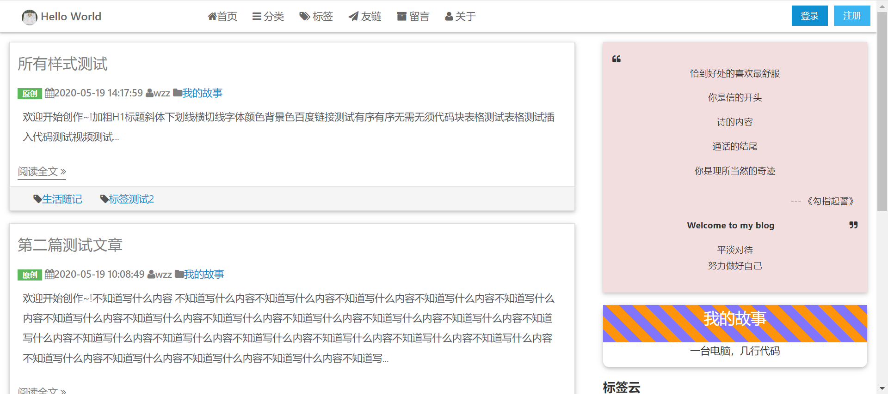
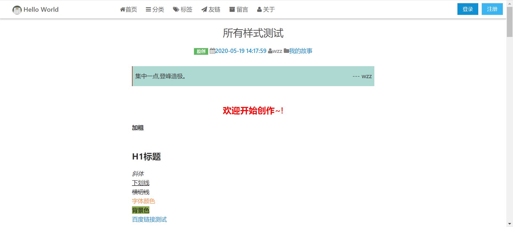
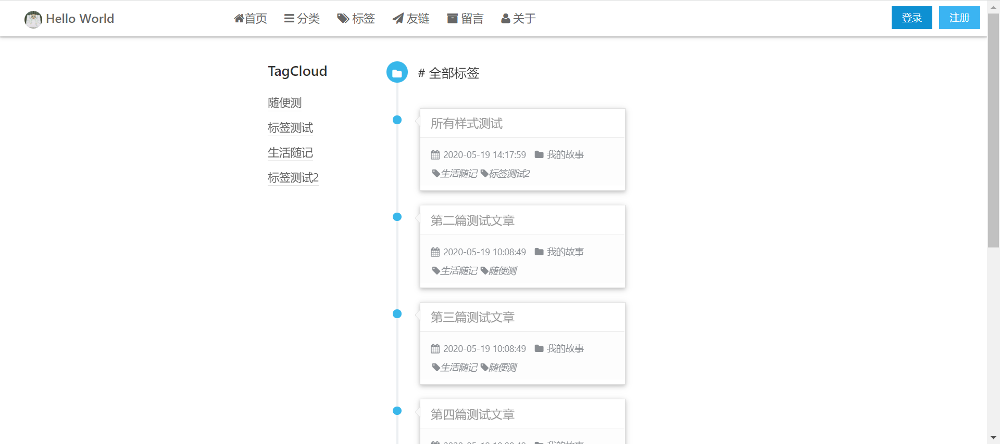
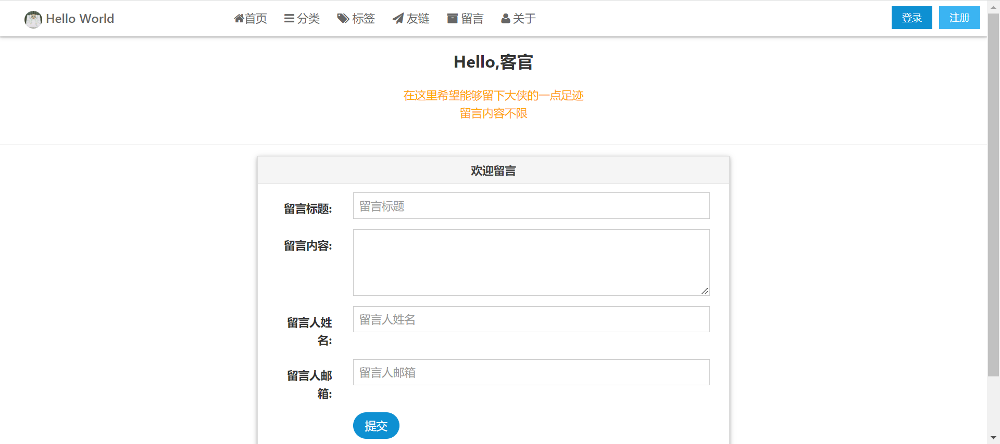
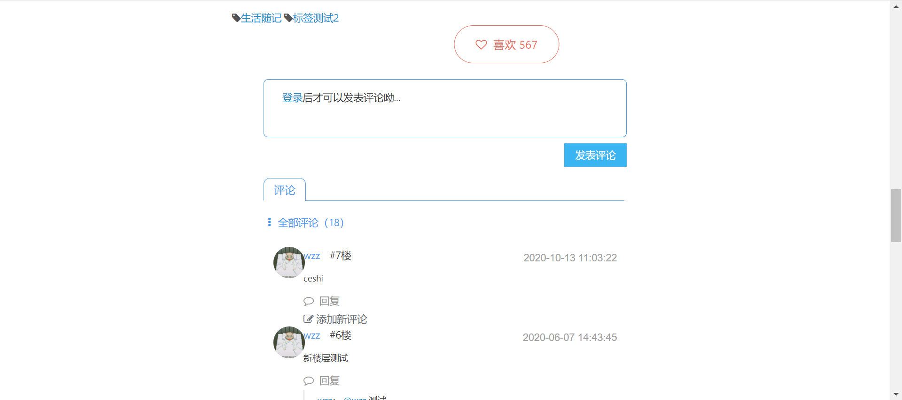
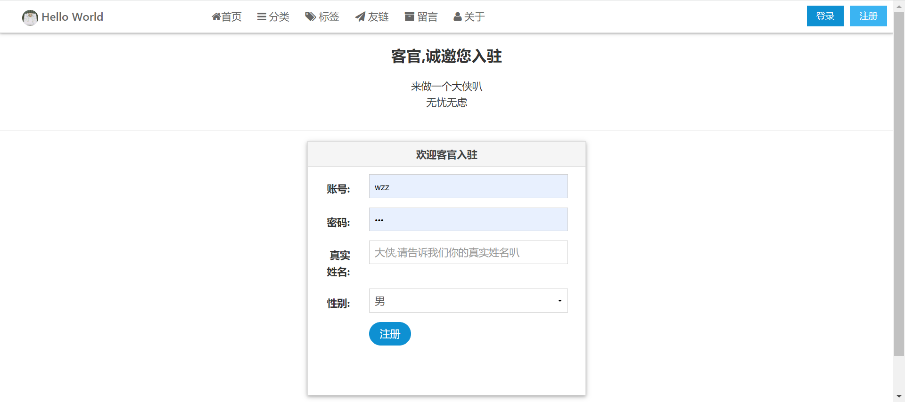
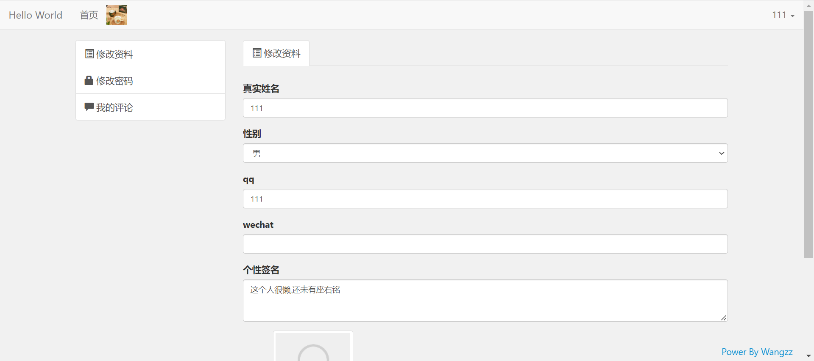
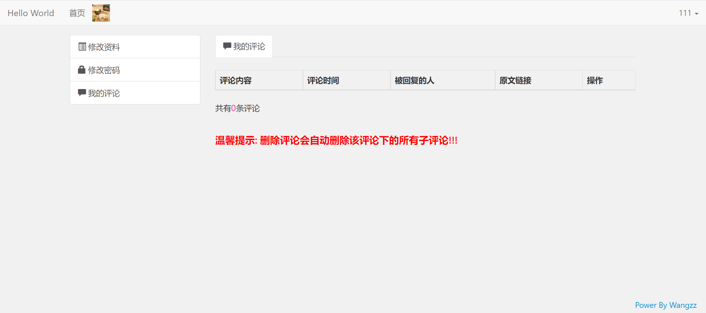
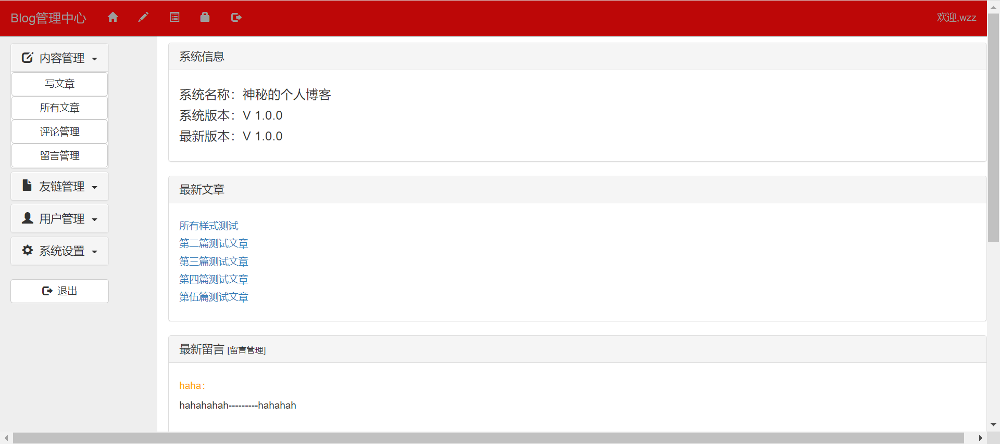
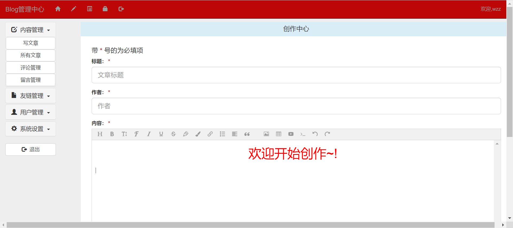
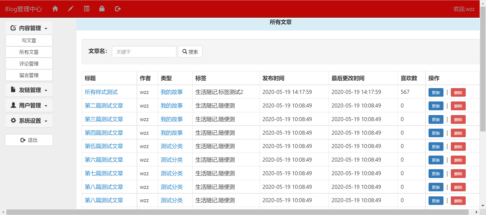

 **

### 案例展示
** 

